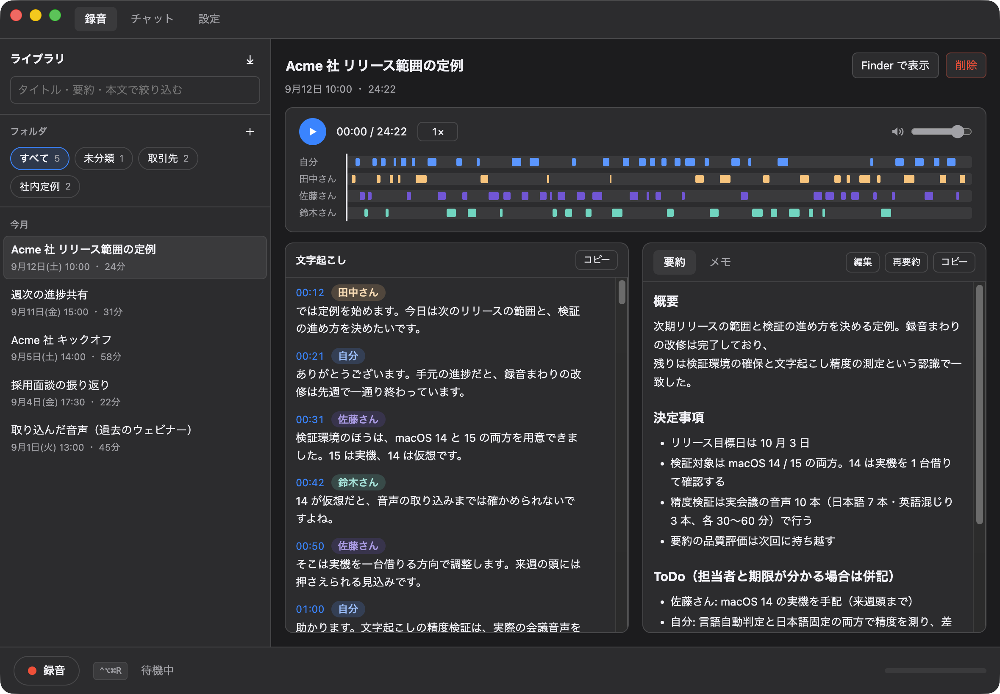

# Duoscribe

[](https://github.com/eddybean/online-meeting-recorder/actions/workflows/ci.yml)
[](https://github.com/eddybean/online-meeting-recorder/actions/workflows/release.yml)

Google Meet / Zoom などの Web 会議を Mac で録音し、**文字起こし・話者識別・要約までを
この Mac の中だけで**行うデスクトップアプリ。音声もテキストも外部には送信しません。



<sub>画面はダミーデータによるものです。</sub>

## できること

- 仮想オーディオデバイスなしでデスクトップ音声とマイクを同時録音
- マイク＝自分／システム音声＝相手として、推論なしで確実に 2 話者へ分離
- 相手側をさらに「参加者A / 参加者B …」へ分ける話者クラスタリング（任意）
- 一度名前を付けた相手は声で覚え、次の録音から自動で同じ名前を当てる → ADR-031
- 喋っていない区間は文字起こししない（無音から生まれる誤った文章を防ぐ）
- 日本語の議事録要約（概要・決定事項・ToDo・議論の流れ）
- 録音一覧と詳細画面（音声再生・話者名の変更・メモ・コピー）
- 手元の音声ファイル（mp3 / m4a / wav / flac / ogg など）を取り込んで、同じ後処理にかける
- フォルダで録音を分類（入れ子可・ドラッグ＆ドロップで移動・タイトルと要約の検索）
- 失敗したステップだけを詳細画面から再実行。話者名を直したあとは要約だけ作り直せる
- 1 分未満の録音は処理せず中断（押し間違えて即停止した録音に推論を回さない）
- モデルの追加ダウンロードと削除を設定画面から操作
- どの画面でも消えない録音／停止ボタンと、メニューバーからの操作
- 無音が続いたら通知して確認（録りっぱなしの防止。自動では停止しません）
- 他のアプリがマイクを使い続けていたら通知して確認（開始忘れの防止。自動では開始しません）

## 動作要件

| 項目 | 要件 |
| --- | --- |
| macOS | 14.2 以上（Core Audio Process Tap を使用） |
| CPU | Apple Silicon 推奨 |
| メモリ | 16GB 以上 |
| 空き容量 | 約 10GB（モデル用） |

## 使い始める

配布されたアプリを使う場合、事前に用意するものはありません。初回起動時の画面で
保存先を選び、モデルの「ダウンロード」を押すだけです。

| モデル | 用途 | サイズ |
| --- | --- | --- |
| whisper large-v3-turbo (q5_0) | 文字起こし | 574MB |
| Silero VAD v5.1.2 (ggml) | 無音区間の除外 | 0.9MB |
| Gemma 4 E4B (QAT q4_0) | 要約 | 5.2GB |
| pyannote segmentation / 3D-Speaker | 話者分割（任意） | 約 35MB |
| whisper エンコーダ (Core ML) | 文字起こしの高速化（任意） | 1.2GB |

ダウンロードは中断でき、次回は途中から再開します。チェックサムを検証するため、
壊れたモデルを掴むことはありません。**モデルが無くても録音は始められます**ので、
先に会議を録っておいて、後から詳細画面で文字起こしと要約を実行できます。

会議では自分も相手も大半の時間は喋っていません。無音をそのまま whisper に通すと、
学習データ（動画の字幕）由来の「ご視聴ありがとうございました」のような文が生成されて
議事録に混ざります。これを防ぐため、**Silero VAD で発話区間だけを whisper に渡します**。
0.9MB と極小なので既定で取得しますが、無くても文字起こしは従来どおり動きます。

### 文字起こしの高速化（Core ML）

任意の 1.2GB をダウンロードすると、whisper のエンコーダが GPU ではなく
Neural Engine で動きます。M4 / 16GB での実測（638 秒の日本語音声）は次のとおりです。

| | Metal のみ | Core ML |
| --- | --- | --- |
| 処理時間 | 41.2 秒（15.5 倍速） | **29.7 秒（21.5 倍速）** |
| エンコード 1 回 | 914ms | 459ms |
| ピークメモリ | 約 960MB | 約 953MB |

**メモリは増えません**し、文字起こしの内容も変わりません（句読点を除いた
文字列で 99.4% 一致）。初回だけ Neural Engine 向けのコンパイルに 20 秒ほど
余計にかかりますが、以降はキャッシュされます。

モデル本体より大きい 1.2GB を全員に強いるだけの差ではないので任意にしています。
**取得しなければ従来どおり Metal だけで動きます**（設定画面からいつでも削除できます）。

要約に Gemma 4 E4B を既定にしているのは **128K のコンテキスト**を持つためです。
1 時間規模の会議でも分割せず一度に読ませられるので、部分要約で文脈が切れて
決定事項を取りこぼすことがありません。既定のコンテキスト長は KV キャッシュの
メモリ消費を抑えるため 32K に設定していますが（設定画面で変更できます）、
1 時間の会議でも分割は起きません。日本語の扱いも強く、QAT 版なので q4 でも
品質の劣化が小さく済みます。要約は `node-llama-cpp` でアプリ内から直接動かすため、
Ollama のような常駐サーバーは不要です。

要約はモデルとコンテキストで約 7GB を一度に確保します。他のアプリで空きが
足りないときは、**モデルを読み込む前に要約を止めて失敗として記録します**。
音声・文字起こし・エンコードはそのまま残るので、アプリを閉じてから詳細画面の
「再実行」を押せば続きから処理できます。判定の厳しさは設定の「メモリ保護」で
「保守的 / 標準 / オフ」から選べます（既定は標準）。→ ADR-024

### 開発者向け

```bash
npm install
npm run setup   # whisper-cli を Homebrew で導入（開発時の近道）
npm run dev
```

モデルはアプリの初期設定画面からダウンロードできるので、`npm run setup` が
入れるのは `whisper-cli` だけです。

## 音声キャプチャの方式

仮想オーディオデバイスは使いません。macOS 14.2 以降の **Core Audio Process Tap** で
システムの出力を複製して取得します。ScreenCaptureKit（画面収録 API）を使わない理由：

| | Core Audio Tap（採用） | ScreenCaptureKit |
| --- | --- | --- |
| 権限 | オーディオ録音のみ | 画面収録 |
| 収録インジケータ | 出ない | 紫のインジケータが常時点灯 |
| 音量の影響 | 受けない（プリミキサー） | システム音量に追従 |
| 映像処理 | 無し | あり |

初回の録音時に「マイク」と「オーディオ録音」の許可を求められます。

## 保存されるもの

保存先は設定画面で選びます（あとから変更できます）。保存先ルートの直下に
各録音のディレクトリが並び、一覧とフォルダの情報は JSON 1 ファイルずつで持ちます。

```
<保存先>/
├── index.json                      # 一覧用のキャッシュ
├── folders.json                    # フォルダの定義（id / 名前 / 親子関係）
├── voiceprints.json                # 覚えた声（次の録音で話者名を自動で当てる）
├── 2026-09-06_1430-3f9c2a71/       # 1 録音 = 1 ディレクトリ
│   ├── meta.json                   # この録音の情報（一覧はここから再構築できる）
│   ├── audio.m4a                   # AAC-LC 32kbps mono（1 時間あたり約 14MB）
│   ├── transcript.json             # 話者・時刻つき（機械可読）
│   ├── transcript.md               # コピペ用
│   ├── summary.md                  # 要約
│   ├── voices.json                 # 話者ごとの声紋（名前を付けたときに覚えるため）
│   └── note.md                     # 自分のメモ
└── 2026-09-06_1600-8d1e04b2/
    └── ...
```

### ディレクトリ名

`YYYY-MM-DD_HHmm-<録音 id の先頭 8 桁>` です。タイトルは後から自由にリネームでき、
その都度ディレクトリを移動したくないので、**タイトルは名前に含めません**。
日時と id だけで一意になります。

### フォルダは物理ディレクトリではない

フォルダ（「チーム定例」など）は `folders.json` に定義だけを持つ論理的な分類で、
保存先にネストしたディレクトリは作りません。各録音の所属は `meta.json` の
`folderId` に入ります。ファイルを移動しないので、分類を変えても録音ディレクトリの
パスは変わらず、Finder や他のツールから開いていたパスが壊れません。

- 未設定の録音は「未分類」として扱われます（サイドバーの「すべて」「未分類」は
  実体のない行で、フォルダと同じ見た目でドロップ先になります）。
- フォルダを削除しても中身は消えません。子フォルダと録音は親フォルダ
  （トップレベルなら未分類）へ退避してから、フォルダ定義だけを消します。

### index.json はキャッシュにすぎない

正は各録音ディレクトリの `meta.json` です。`index.json` は一覧表示を速くするための
キャッシュで、失われたり壊れたりしても各ディレクトリの `meta.json` を走査して
作り直します。利用者が Finder で録音ディレクトリを移動・整理しても壊れません。

### 保存先に置かないもの

録音中の中間ファイルは保存先ではなく、アプリの作業ディレクトリ
（`~/Library/Application Support/<アプリ名>/work/<録音 id>/`）に置きます。
`system.wav`（相手）・`mic.wav`（自分）・`mix.wav`・`tracks.json` が入り、
エンコードが終わると削除されます。保存先には**他のツールからも読める形**
（m4a / Markdown / JSON）だけを残すためです。

音声コーデックは設定で変更できます。既定を AAC-LC にしているのは、HE-AAC (`aach`) を
16kHz モノラルに指定すると `afconvert` が指定ビットレートを無視してコアを 8kHz・
約 10kbps まで落とし、会議音声の明瞭さを損なうためです。

モデルは録音の保存先ではなく `~/Library/Application Support/<アプリ名>/models/` に
置かれます。モデルは会議の成果物ではなく再取得できるキャッシュなので、
保存先を圧迫させないためです。設定は同じ場所の `settings.json` に保存します。
不要になったモデルは設定画面から削除でき、必要になったら再びダウンロードできます。

## ドキュメント

`docs/` に HTML で置いています。ブラウザで直接開けます。

| ページ | 内容 |
| --- | --- |
| [docs/index.html](docs/index.html) | 概要と現状 |
| [docs/specification.html](docs/specification.html) | 仕様（動作要件・保存形式・画面・設定・非対応範囲） |
| [docs/architecture.html](docs/architecture.html) | アーキテクチャ（層構造・プロセス構成・パイプライン） |
| [docs/decisions.html](docs/decisions.html) | 意思決定記録。採用／不採用の根拠と実測値 |

## アーキテクチャ

依存は常に内向き（`src/domain` が最も安定した中心）。

```
src/
├── domain/          エンティティと業務ルール。依存ゼロ
├── application/
│   ├── ports/       外界との境界（インターフェース）
│   └── usecases/    ユースケース。Electron も whisper も llama.cpp も知らない
├── infrastructure/  ポートの実装（audiotee / whisper-cli / llama.cpp / sherpa-onnx / ファイル）
├── main/            Electron main。container.ts が唯一の結線場所
├── preload/         contextBridge で型付き API を公開
└── renderer/        React の UI
```

この境界のおかげで、モデルやバックエンドの差し替えは
[`src/main/worker/pipeline-container.ts`](src/main/worker/pipeline-container.ts) と
設定値だけで完結します。ユースケースは `whisper` も `llama.cpp` も知りません。

### 停止後のパイプライン

`ミックス → 文字起こし → 話者識別 → 要約 → エンコード` の順に実行します。

- ステップ同士は**成果物ファイル経由でのみ**つながるため、詳細画面から
  **失敗したステップだけを再実行**できます。成功済みのステップも対象外ではなく、
  話者名を直したあとに要約パネルの**再要約**で要約だけ作り直せます。
- **1 分未満の録音はミックスもせずに中断**します。録音ボタンの押し間違いに
  数分の推論を掛けても得られるものが無いためで、中間 WAV もその場で片付けます。
- 失敗は**依存するステップだけ**を止めます。要約に失敗しても音声とエンコードは
  完了するので、最も価値の高い成果物が守られます。
- パイプラインは `utilityProcess` で動きます。llama.cpp や sherpa-onnx の
  ネイティブコードが落ちても、アプリ本体と録音済みのファイルは残ります。

## 開発

```bash
npm test         # 465 件（domain / application / infrastructure / 統合）
npm run typecheck
npm run dev
npm run build
npm run package  # 配布用の .dmg を作る
```

### リリース

`v` から始まるタグを push すると [GitHub Actions](.github/workflows/release.yml) が
macOS ランナーで .dmg をビルドし、Release に添付します。

```bash
npm version patch      # package.json の version を上げてタグを作る
git push --follow-tags
```

証明書を用意しない場合は ad-hoc 署名でビルドされます。Core Audio Process Tap の
権限は署名済みバイナリでしか有効にならないため、まったく署名しないという選択肢は
ありません。ただし ad-hoc 署名の配布物は Gatekeeper に隔離されるので、利用者側で
一度だけ次の操作が必要です（Release の説明文に自動で記載されます）。

```sh
xattr -dr com.apple.quarantine "/Applications/Duoscribe.app"
```

この手順は .dmg に同梱した「はじめにお読みください.txt」にも書いてあります。

Apple Developer 証明書がある場合は、リポジトリの Secrets に登録すると
electron-builder が正式な署名と公証を行い、この手順は不要になります。

| Secret | 内容 |
| --- | --- |
| `MAC_CERT_P12_BASE64` | Developer ID Application 証明書（.p12）を base64 化したもの |
| `MAC_CERT_PASSWORD` | その .p12 のパスワード |
| `APPLE_ID` / `APPLE_APP_SPECIFIC_PASSWORD` / `APPLE_TEAM_ID` | 公証用（3 つ揃うと実行される） |

**アプリ名は ASCII のままにしてください。** `productName` を日本語にすると、
生成されたアプリが起動直後に SIGTRAP で落ちます（実行ファイル名・ヘルパーアプリ名・
フレームワーク参照がすべてこの名前から作られるため）。

### whisper-cli の同梱

whisper.cpp は macOS 向けの CLI バイナリを配布していません（リリース資産は
xcframework と Linux/Windows 版のみ）。配布したアプリの利用者に Homebrew を
求めないため、`npm run package` の中で `scripts/build-whisper.sh` が
whisper.cpp を Metal と Core ML を有効にしてビルドし、`resources/bin/whisper-cli`
として同梱します。Core ML は `WHISPER_COREML_ALLOW_FALLBACK` 付きなので、
上記のエンコーダを持たない利用者でも Metal だけで問題なく動きます。

なお `npm run setup` が入れる Homebrew の `whisper-cpp` は Core ML 無しでビルド
されているため、**開発中に高速化を確認したいときは `npm run build:whisper` で
ビルドしたものを設定でパス指定してください**。

実行時は次の順で解決します。設定でパスを明示すればそれが最優先なので、
手元でビルドした版を使うこともできます。

1. 設定に書かれたパス（既定値 `whisper-cli` 以外のとき）
2. 同梱バイナリ（パッケージ済みアプリのとき）
3. PATH 上の `whisper-cli`（開発時）

`postinstall` で `scripts/patch-dev-electron.sh` が走り、開発用の Electron.app に
`NSAudioCaptureUsageDescription` と `NSMicrophoneUsageDescription` を注入して
ad-hoc 再署名します。これが無いと開発中に音声キャプチャの権限を取得できません。

### モジュール形式について

main / preload は electron-vite の既定である **CJS** で出力します。Electron は 28 以降
ESM の main も扱えますが、ESM 専用の `audiotee` と `node-llama-cpp` は動的 `import()`
で読み込めばよく（CJS 出力でも `import()` は `require` に変換されません）、既定の
構成から外れる利点がありません。

なお、シェルに `ELECTRON_RUN_AS_NODE=1` が設定されていると Electron が素の Node と
して起動し、`require('electron')` が API を返さないため起動に失敗します。起動しない
ときはこの環境変数を確認してください。

テストは `~/.claude/rules/tdd.md` に従い先に書いています。ユースケースは Fake
だけで完全に検証でき、サーバーも DB も起動しません。統合テストは実際の
ファイル I/O と `afconvert` を通します。

## ライセンス

[PolyForm Noncommercial License 1.0.0](LICENSE) に
[追加条項](LICENSE-ADDENDUM.md)を加えた条件で公開しています。OSI 承認のオープン
ソースライセンスではなく、ソースを公開しているだけの **source-available** な
プロジェクトです。

- **個人利用・学習・研究・非営利団体での利用は自由**です
- **商用利用はできません**。本アプリまたはその改変版を販売・有償提供する場合は
  個別の許諾が必要です
- 改変版を配布する場合は、対応するソースコードを同一条件で提供してください
- 本リポジトリのコードを機械学習モデルの訓練・評価に使うことを禁じます
  （アプリを**動かして得た**録音・文字起こし・要約は利用者のものです）

Pull Request は歓迎します。ライセンス上の前提は [CONTRIBUTING.md](CONTRIBUTING.md)
を参照してください。

同梱・利用しているサードパーティのライブラリはいずれも許諾的ライセンスです
（whisper.cpp / audiotee / node-llama-cpp / Electron / React = MIT、
sherpa-onnx = Apache-2.0）。それぞれのライセンスは各配布元に従います。
